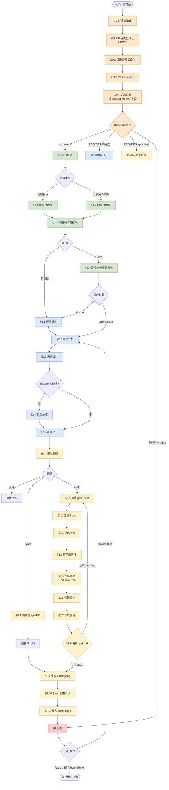

# SDD Workflow v3.7 — 完整流程图与使用指南

> 本文档是 NY-SDD-Workflow v3.7 的完整参考手册，涵盖架构全景、流程图、使用指南、FAQ 和避坑指南。
> 配套文件：`AGENTS.md`（核心规则）、`rules/phase-*.md`（阶段规则）、`README.md`（项目概览）。

---

## 第一部分：架构全景

### 1.1 两套编号体系

```
═══════════════════════════════════════════════════════════════════
                     SDD Workflow v3.7 架构
═══════════════════════════════════════════════════════════════════

┌─────────────────────────────────────────────────────────────┐
│  AGENTS.md（始终加载 — 所有 AI 工具可读）                     │
│  ─────────────────────────────────────                       │
│  ⦿ 编号与流程声明规约（7 条）                                  │
│                                                              │
│  G 系列全局规则（Global，大写前缀）：                          │
│    G0  对话初始化（G0.1~G0.5 五个子步骤）                     │
│    G1  写码门禁（6 项检查）                                   │
│    G2  停车信号（5 类场景）                                   │
│    G3  未覆盖场景兜底                                         │
│                                                              │
│  阶段路由表 + 按需加载索引                                     │
└─────────────────────────────────────────────────────────────┘
                          │
                          │ AI 按阶段码动态加载
                          ▼
┌─────────────────────────────────────────────────────────────┐
│  phase-*.md（按需加载 — 仅 Claude Code / Codex 支持）          │
│  ─────────────────────────────────────                       │
│  ⦿ 每个 §N.N 章节顶部含「流程声明头」引用块                    │
│     字段：phase / step / prev / next / gate / blocking        │
│                                                              │
│  § 系列阶段流程（Stage，§ 前缀）：                             │
│    §1  项目启动          phase-init.md                       │
│      §1.1~§1.5  新/旧项目 + 规范提取 + 深度扫描 + 文档规则      │
│                                                              │
│    §2  需求与设计        phase-spec.md                       │
│      §2.1~§2.6  任务拆分 + 需求/方案 + 原型 + 评审 + Sync      │
│                                                              │
│    §3  编码变更通道      phase-coding.md                     │
│      §3.0~§3.11  通道判断 + 标准 11 步                        │
│                                                              │
│    §4  归档              phase-archive.md                    │
│      12 项检查 + 衔接下一模块                                 │
└─────────────────────────────────────────────────────────────┘
```

**核心语义**：
- **G 前缀** = Global，始终加载，不带流程声明头
- **§ 前缀** = Stage，按需加载，每个章节带流程声明头
- **流程声明头** = AI 进入章节前必读的元数据块，机械跳转不靠推理

---

### 1.2 加载机制

```
每次对话开始时
  │
  ├─→ 加载 AGENTS.md（G 系列 + 规约 + 路由表）
  │    所有 AI 工具都读到这一层
  │
  └─→ AI 执行 G0 对话初始化
       │
       ├─→ G0.1 项目类型确认（询问用户 A/B/C/D）
       ├─→ G0.2 目录骨架初始化
       ├─→ G0.3 文档补充确认
       ├─→ G0.4 状态恢复（读 context.md 的 last 字段定位）
       └─→ G0.5 阶段路由 → 按状态加载对应的 phase-*.md
                          │
                          ▼
                   仅 Claude Code / Codex 会真正加载
                   其他工具（Cursor/Copilot）仅读 AGENTS.md
```

---

## 第二部分：主流程图

### 2.1 顶层主干流程



---

### 2.2 三类任务路径对比

#### 路径 A：新项目 feature

```
G0.1 选 A
  ↓
G0.2 创建目录骨架
  ↓
G0.3 文档补充（PRD 必须，技术文档可选）
  ↓
G0.5 路由 → §1（无 .project/）
  ↓
§1.1 新项目流程
  · PRD 审计（调用 /prd-audit Skill）
  · 扫描 .docs/
  · 询问技术栈 + 外部依赖
  · 脚手架创建（调用 /java-project-creator 或 /wap-project-creator）
  ↓
§1.3 前后端规范提取
  · 调用 /front-project-context 或 /back-project-context
  · 产出 frontend-context.md / backend-context.md
  ↓
§2.1 任务拆分
  · 模块排序（P0>P1>P2 + 依赖）
  · 子任务拆分（数据层/后端/前端/联调 4 维度）
  · 写入 index.md + task.md
  · 询问执行模式（连续/逐个确认）
  ↓
§2.2 需求分析（模块级 REQ）
  ↓
§2.3 方案设计（模块级 DES）
  ↓
§2.4 原型生成（仅含前端）
  ↓
§2.5 评审（人工 approved）
  ↓
§3.0 通道判断 → §3.1 ~ §3.11 标准通道
  (§3.8 有 pending → 循环回 §3.1)
  ↓
§4 归档
  ↓
连续模式 → §2.2 下一模块 ↺
逐个确认 → 等待用户
```

#### 路径 B：旧项目 feature

```
G0.1 选 B
  ↓
G0.5 路由 → §1
  ↓
§1.2 旧项目流程
  · 扫描代码 + .docs/
  · 识别技术栈 + 外部依赖 + 数据库结构
  · 人工确认（危险区/分支/部署/性能/基线）
  ↓
§1.3 前后端规范提取
  ↓
§1.4 深度业务代码扫描
  · 调用 /reverse-scan Skill
  · 产出知识卡片 + 调用图 + 模块地图 + 逆向 REQ/DES
  · 合并到 project-profile.md
  ↓
§2.1 任务拆分（与新项目一致）
  ↓
... 同路径 A 后续
```

#### 路径 C：旧项目 bug

```
G0.1 选 C
  ↓
G0.5 路由 → §1
  ↓
§1.2 旧项目流程
  ↓
§1.3 前后端规范提取
  ↓
§1.4 深度业务代码扫描
  ↓
§2.2 需求分析（跳过 §2.1 任务拆分）
  · AI 主动收集 Bug 信息（复现步骤/预期 vs 实际/影响范围/严重程度）
  · 定位受影响模块 → REQ 头部 affected-module
  ↓
§2.3 方案设计
  · 根因分析 + 修复方案
  · 受影响 Spec 变更清单
  ↓
§2.5 评审（跳过 §2.4 原型）
  ↓
§3.0 → ... 编码通道
  ↓
§3.10 Spec 状态同步
  · DES 级联更新（文档同步）
  ↓
§4 归档 → 等待用户（不自动衔接）
```

#### 路径 D：旧项目 refactor

```
G0.1 选 D
  ↓
G0.5 → §1.2 → §1.3 → §1.4
  ↓
§2.2 需求分析（技术优化）
  · 优化目标 + 不变边界 + 验证方式
  · 询问是否创建 task.md 跟踪多步骤
  ↓
§2.3 方案设计
  · 重构方案 + 改动前后对比
  · 回归验证计划
  ↓
§2.5 评审
  ↓
§3.0 → 编码通道
  ↓
§4 归档 → 等待用户
```

---

## 第三部分：编码阶段详图

### 3.1 §3 编码变更通道完整路径

```
§2.5 评审 approved
  │
  │  (或 G0.5 直接进入：REQ+DES 已 approved)
  ▼
┌─────────────────────────────────────────┐
│ §3.0 通道判断                            │
│   直通：不涉及代码 → 直接回答            │
│   快速：仅样式/文案 → §3.1→改码→§3.9    │
│   标准：业务逻辑/接口 → §3.1~§3.11      │
└─────────────────────────────────────────┘
  │
  ▼ (标准通道)
┌─────────────────────────────────────────┐
│ §3.1 加载规范 + 铁律                     │
│  §3.1.1 铁律检查（细查）                  │
│  §3.1.2 已有代码认知（reverse-scan）     │
│  §3.1.3 编码上下文加载（context 文件）    │
│  §3.1.4 UI 上下文加载(前端改动时)         │
└─────────────────────────────────────────┘
  │
  ▼
┌─────────────────────────────────────────┐
│ §3.2 加载 Spec                           │
│  读 index.md 模块路由                    │
│  读 REQ + DES                           │
│  检查 sync-status / coding/audit-skill  │
│  定位当前 task.md 子任务                 │
└─────────────────────────────────────────┘
  │
  ▼
┌─────────────────────────────────────────┐
│ §3.3 文档学习（按需）                     │
│  未覆盖的 API/库 → 询问用户或读 .docs/   │
└─────────────────────────────────────────┘
  │
  ▼
┌─────────────────────────────────────────┐
│ §3.4 影响面评估                          │
│  6 维度：功能/数据/流程/架构/安全/性能    │
│  超出当前通道 → 触发 G2 停车              │
└─────────────────────────────────────────┘
  │
  ▼
┌─────────────────────────────────────────┐
│ §3.5 代码变更  ⚠ 触发 G1 写码门禁          │
│  6 项门禁检查通过后才能改代码             │
│  task.md 当前子任务 → in-progress        │
│  调用编码 Skill 或用 context 规范         │
│  遵守 C-01~C-10 + U-01~U-06              │
└─────────────────────────────────────────┘
  │
  ▼
┌─────────────────────────────────────────┐
│ §3.6 代码审计                            │
│  调用 /code-audit Skill 或用 S-01~S-07   │
│  修复超 3 次 → 触发 G2 停车               │
└─────────────────────────────────────────┘
  │
  ▼
┌─────────────────────────────────────────┐
│ §3.7 开发自测                            │
│  T-01~T-06 逐项验证                      │
│  循环 §3.5→§3.6→§3.7 超 5 次 → 触发 G2   │
└─────────────────────────────────────────┘
  │
  ▼
┌─────────────────────────────────────────┐
│ §3.8 更新 task.md                        │
│  当前子任务 → done                       │
│  检查模块是否还有 pending？              │
└─────────────────────────────────────────┘
  │                           │
  │ 无 pending                │ 有 pending
  ▼                           ▼
┌──────────┐          ┌────────────────┐
│ §3.9     │          │ 回 §3.1 循环    │
│ Changelog│          │ (下次 §3.5 重新 │
└──────────┘          │  触发 G1 门禁)  │
  │                   └────────────────┘
  ▼
┌─────────────────────────────────────────┐
│ §3.10 Spec 状态同步                      │
│  feature: index.md sync-status → synced │
│  bug/refactor: 受影响模块 DES 级联更新    │
└─────────────────────────────────────────┘
  │
  ▼
┌─────────────────────────────────────────┐
│ §3.11 写入 context.md                    │
│  记录完成内容/遗留问题/下一步建议         │
│  标注 last: §3.11（下次进入 §4 归档）     │
└─────────────────────────────────────────┘
  │
  ▼
§4 归档
```

---

### 3.2 快速通道路径（仅样式/文案）

```
§3.0 通道判断 → 快速通道
  ↓
§3.1 加载规范 + 铁律
  ↓
直接改代码（省略 §3.2~§3.8）
  ↓
§3.9 生成 Changelog
  ↓
§3.10 Spec 状态同步
  ↓
§3.11 写入 context.md
  ↓
§4 归档
```

---

## 第四部分：横切动作

### 4.1 §2.6 Spec Sync（随时触发）

```
用户在任意阶段说：
  "我改了 REQ/DES" → [specs] 触发
  "需求变了" / "PRD 改了" / "加个功能" → [prd] 触发
  "文档更新了" / "API 文档改了" → [tech] 触发
    ↓
┌─────────────────────────────────────────┐
│ §2.6 Spec Sync                           │
│  Step 1 变更识别与审计                    │
│  Step 2 影响分析                          │
│    a. 新增模块 → 建 REQ/DES + 拆子任务    │
│    b. 已有模块变更 → 更新 REQ/DES         │
│    c. 索引/配置变更 → 更新 profile       │
│  Step 3 级联更新                          │
│  Step 4 一致性扫描                        │
│  Step 5 留痕（change-log-specs.md）       │
│  Step 6 outdated 模块处理                │
└─────────────────────────────────────────┘
  ↓
返回触发时所在的阶段继续
```

### 4.2 G1 写码门禁（编码前强制）

```
AI 准备执行 §3.5 代码变更
  ↓
自动触发 G1 门禁检查（6 项）
  ┌─────────────────────────────────┐
  │ 1. .project/ 已初始化？           │
  │ 2. REQ+DES review-status:approved?│
  │ 3. 阻塞依赖就绪？                 │
  │ 4. 编码/审计 Skill 已安装？        │
  │ 5. task.md 有 pending 子任务？    │
  │ 6. 与项目铁律无冲突？             │
  └─────────────────────────────────┘
  ↓
全 ✅ → 继续 §3.5
任一 ❌ → 输出缺失项 → 触发 G2 停车
```

### 4.3 G2 停车信号（5 类场景）

```
AI 执行中遇到：
  1. 路由不确定         → 两种判断请用户选
  2. 影响面超预期       → 列清单建议升级通道
  3. 循环超限           → 审计>3 次 / 自愈>5 次
  4. 规则冲突           → Spec/铁律/DES 矛盾
  5. 未覆盖场景         → G3 兜底
    ↓
立即暂停，向用户报告并等待裁决
"停车不是失败，是负责任"
```

---

## 第五部分：详细使用指南

### 5.1 安装

#### 方式 1：Skills 体系（推荐）

```bash
# 安装
npx skills add https://git.nykjsrv.cn/ai-coding/skills.git \
  --skill ny-sdd-workflow --yes

# 在 AI 对话中触发初始化
你说："初始化工作流"
```

AI 会自动：
1. 将 `AGENTS.md`（G 系列核心规则 + 编号流程规约）写入项目根
2. 创建各 AI 工具的 symlink
3. 输出初始化状态报告

#### 方式 2：npx CLI

```bash
# 全选同步所有 AI 工具
npx @nykj/ny-sdd-workflow init --tools=A

# 仅同步 Cursor + Copilot
npx @nykj/ny-sdd-workflow init --tools=1,2

# 不同步任何工具，仅 AGENTS.md
npx @nykj/ny-sdd-workflow init --tools=N

# 查看状态
npx @nykj/ny-sdd-workflow status

# 更新到最新版本
npx @nykj/ny-sdd-workflow update

# 卸载（清理 symlink）
npx @nykj/ny-sdd-workflow remove
```

#### 安装后的目录结构

```
项目根目录/
├── AGENTS.md                      ← G 系列核心规则（写死路径）
├── .cursor/rules/ny-sdd-workflow.md
├── .github/copilot-instructions.md
├── .clinerules
├── ...其他工具 symlink
│
├── .docs/                         ← 你要准备的文档（重要）
│   ├── prd/                       ← PRD、原型图、UI 设计稿
│   └── tech/                      ← API 文档、建表脚本
│
├── .project/                      ← AI 自动创建和维护
│   ├── context.md                 ← 每次对话必读
│   ├── task.md                    ← 子任务进度
│   └── specs/...
│
├── .outdocs/                      ← AI 产出的交付文档
│   ├── project-overview.md
│   ├── api-doc.md
│   ├── audit-report.md
│   └── ...
│
└── .agents/skills/                ← Skill 安装目录
    └── ny-sdd-workflow/
```

---

### 5.2 首次使用（新项目）

**前置准备**：

1. 把 PRD / UI 原型图 放到 `.docs/prd/`（必需）
2. 把 API 文档 / 建表脚本 放到 `.docs/tech/`（可选）
3. 项目根目录有 `AGENTS.md`（由安装步骤生成）

**第一次对话的典型交互**：

```
👤 你：开始开发

🤖 AI：【项目确认】
       请问这是新项目还是旧项目？
         A. 新项目（请提供 PRD）
         B. 旧项目 — 新增需求
         C. 旧项目 — Bug 修复
         D. 旧项目 — 技术优化

👤 你：A

🤖 AI：[创建目录骨架]
       [扫描 .docs/prd/ 读取 PRD]
       [执行 PRD 审计]
       【技术栈确认】
         1. 前端框架？
         2. 后端框架？
         3. 数据库？
         4. 前端代码根目录？
         5. 后端代码根目录？

👤 你：Vue3 + Spring Boot + MySQL
       前端 src/，后端 server/

🤖 AI：【外部依赖确认】
       1. 第三方 API？
       2. 公司内部其他服务接口？
       3. 指定的前端组件库或工具库？

👤 你：微信支付、高德地图

🤖 AI：[调用 wap-project-creator 创建前端脚手架]
       [调用 java-project-creator 创建后端脚手架]
       [调用 front/back-project-context 提取规范]
       [生成 project-profile.md + context 文件]
       [进入 §2.1 任务拆分]

       【开发计划】
         第 1 轮：01-用户认证（P0，无依赖）
         第 2 轮：02-订单管理（P1，依赖 01）
         第 3 轮：03-支付接入(P1，依赖 02)
         ...
       请确认或调整顺序。

👤 你：OK

🤖 AI：[输出全量模块的子任务拆分]
       【模块 01-用户认证 子任务拆分】
         01-1 [数据层] 用户表设计+迁移
         01-2 [后端] POST /api/auth/login
         01-3 [前端] 登录页表单
         01-4 [联调] 登录流程联调
       ... （所有模块依次列出）
       总计 N 项。请确认或调整。

👤 你：OK

🤖 AI：[写入 task.md]
       【执行模式】
         A. 连续模式：自动连续执行所有模块
         B. 逐个确认模式：每个模块完成后询问（默认）

👤 你：B

🤖 AI：[更新 context.md]
       [进入 §2.2 需求分析（第一个模块 01-用户认证）]
       【需求澄清】
       我理解这次要做"用户认证"，但有以下几点需要确认：
         1. 登录方式是密码还是短信验证码？
         2. 是否支持第三方登录？
         3. Session 过期时间？
       请确认后继续。

👤 你：密码登录；不支持第三方；Session 2 小时

🤖 AI：[写入 REQ]
       [REQ 自审通过]
       [进入 §2.3 方案设计]
       [写入 DES]
       [DES 自审通过]
       [进入 §2.4 原型生成]
       [生成 HTML 线框图]
       [进入 §2.5 评审]

       【方案评审】
       请人工确认 REQ + DES + 原型。通过后回复"通过"开始开发。

👤 你：通过

🤖 AI：[标记 review-status: approved]
       [进入 §3.0 通道判断 → 标准通道]
       [加载规范 + 铁律检查]
       [加载 Spec + task.md 定位第一个子任务 01-1]
       [评估影响面]
       [触发 G1 门禁 → 全部通过]
       [编写用户表迁移脚本]
       [代码审计 S-01~S-07 通过]
       [开发自测 T-04~T-06 通过]
       [更新 task.md: 01-1 → done]
       [当前模块还有 01-2 pending，回到 §3.1 循环]
       ...
       (所有子任务完成)
       [生成 Changelog]
       [Spec 状态同步]
       [写入 context.md: last: §3.11]
       [进入 §4 归档]
       [12 项检查通过]

       【模块完成】01-用户认证 已归档。
       下一模块：02-订单管理（dev-order: 2）
       是否进入？
         A. 进入
         B. 跳过，选择其他模块
         C. 暂停开发

👤 你：A
...
```

---

### 5.3 日常使用（旧项目）

#### 场景 A：新增一个功能（feature）

```
👤 你：我要加一个"订单导出 Excel"功能

🤖 AI：【项目确认】
       A/B/C/D？

👤 你：B

🤖 AI：[G0.4 读 context.md 恢复项目状态]
       [旧项目，.project/ 已存在]
       [G0.5 路由 → §2 需求与设计]
       [进入 §2.1 任务拆分 — 因为是 feature，需要模块拆分]
       [发现当前功能归入已有模块 02-订单管理]
       [不重复建模块，只拆子任务写入 task.md]
       [进入 §2.2 需求分析]
       ... （后续与新项目一致）
```

#### 场景 B：修复 Bug

```
👤 你：用户反馈：点击登录按钮后页面白屏

🤖 AI：[G0.1 项目类型 - 已知旧项目，自动按 bug 处理]
       [G0.5 路由 → §2.2 需求分析（跳过 §2.1）]

       【Bug 定位】
       请确认以下信息：
         1. 复现步骤？
         2. 预期行为 vs 实际行为？
         3. 影响范围？
         4. 严重程度：P0/P1/P2？

👤 你：[详细描述]

🤖 AI：[定位受影响模块 → affected-module: 01-用户认证]
       [写入 REQ.md，头部标记 affected-module]
       [进入 §2.3 方案设计 — 根因分析 + 修复方案 + 受影响 Spec 变更清单]
       [进入 §2.5 评审（跳过 §2.4 原型）]

       请人工评审 REQ + DES。

👤 你：通过

🤖 AI：[进入 §3.0 → §3.1 ~ §3.11]
       [修复代码]
       [§3.10 Spec 状态同步 → 更新 01-用户认证 的 DES 对应部分]
       [§4 归档]

       【任务完成】Bug-点击登录白屏 已归档。
       下一步？
         A. 继续处理其他 Bug
         B. 回到 feature 开发
         C. 暂停
```

#### 场景 C：技术优化 refactor

```
👤 你：我想把订单查询的 N+1 问题重构掉

🤖 AI：[G0.1 按 refactor 处理]
       [加载相关代码认知]

       【优化目标确认】
       请确认以下信息：
         1. 优化什么？（具体目标）
         2. 不改什么？（业务行为不变的边界）
         3. 如何验证？（怎么证明优化有效且无回归）

👤 你：[回答]

🤖 AI：[写 REQ]
       [进入 §2.3 方案设计]

       【任务管理确认】
       本次技术优化涉及多个步骤：
         1. 添加批量查询 Mapper
         2. 重构 Service 逻辑
         3. 单元测试覆盖
       是否创建 task.md 跟踪进度？
         A. 是（按步骤推进，每步回到门禁自检）
         B. 否（AI 一次性完成所有步骤）

👤 你：A

🤖 AI：[创建子任务到 task.md]
       [进入 §2.5 评审]
       ...
```

---

### 5.4 多轮对话与状态恢复

**核心机制**：`.project/context.md` 的 `last: §N.N` 字段

#### 对话 1（中途结束）

```
👤 你：[开发到一半，下班了]

🤖 AI：[已经完成 01-用户认证 REQ，正在写 DES]
       [context.md 最后一条记录：]
       ### 2026-04-15 01-用户认证 REQ 完成
       - last: §2.2 需求分析（下次进入 §2.3 方案设计）
```

#### 对话 2（第二天恢复）

```
👤 你：继续开发

🤖 AI：[G0.4 读 context.md]
       [最后一条 last: §2.2]
       [知道下一步是 §2.3 方案设计]
       [直接加载 phase-spec.md，定位 §2.3]
       [读 §2.3 声明头确认 prev=§2.2, next=§2.4/§2.5]
       [继续编写 DES...]
```

**状态恢复的可靠性**：

| 关键节点 | context.md last 字段 | 恢复精度 |
|---|---|---|
| §2.1 任务拆分完成 | `last: §2.1` | 下一步 §2.2 |
| §2.2 REQ 完成 | `last: §2.2` | 下一步 §2.3 |
| §2.3 DES 完成 | `last: §2.3` | 下一步 §2.4/§2.5 |
| §2.6 Spec Sync 完成 | `last: §2.6` | 返回触发阶段 |
| §3.11 编码收尾 | `last: §3.11` | 下一步 §4 |
| §4 归档完成 | `last: §4` | 下一步 §2.2（连续）/ 等待用户 |

---

### 5.5 特殊场景处理

#### 场景 1：Spec Sync（需求变更）

```
👤 你：PRD 改了，订单导出要支持 CSV 格式

🤖 AI：[识别触发源 = prd]
       [进入 §2.6 Spec Sync]
       [Step 1 重读 PRD，执行 PRD 审计]
       [Step 2 影响分析 — 定位 02-订单管理 需要更新]
       [Step 3 级联更新 REQ/DES/context 文件]
       [Step 4 一致性扫描 — 代码已有实现 → sync-status 标记为 outdated]

       【同步确认】
       本次改动导致以下模块 specs 与代码不一致：
         - 02-订单管理（outdated）
       是否现在同步代码？
         A. 立即同步（进入标准通道）
         B. 稍后处理（保持 outdated）

👤 你：A

🤖 AI：[进入 §3.0 → 标准通道]
       ...
```

#### 场景 2：快速通道（仅改样式）

```
👤 你：登录按钮颜色改成品牌色 #FF6B00

🤖 AI：[§3.0 通道判断 — 仅样式，快速通道]
       [§3.1 加载规范 + 铁律]
       [直接改 CSS]
       [§3.9 生成 Changelog]
       [§3.10 Spec 状态同步]
       [§3.11 写入 context.md]
       [§4 归档（部分检查项跳过）]
```

#### 场景 3：G2 停车信号触发

**示例 a**：通道判断不确定

```
👤 你：加个日志打印

🤖 AI：【G2 停车信号 — 通道判断不确定】
       这个改动可能属于：
         1. 快速通道：仅添加一行 log，不改逻辑
         2. 标准通道：涉及日志格式规范和埋点
       请选择走哪个通道？

👤 你：1
```

**示例 b**：影响面超预期

```
🤖 AI：[§3.4 影响面评估]
       【影响面评估】
         - 功能关联：影响 3 个其他模块的数据查询
         - 数据关联：涉及核心订单表结构变更
         - 业务流程：影响支付流程的状态流转
       结论：影响面超出快速通道预期

       【G2 停车信号】
       本次改动影响面超出预期，建议升级到标准通道。
       是否确认升级？
```

#### 场景 4：铁律冲突

```
🤖 AI：[§3.1.1 铁律检查]
       【铁律冲突】
       本次变更违反了以下铁律：
         - "涉及金额的字段必须使用 Decimal，禁止使用 Float"
         - 当前方案在 OrderDTO 中用了 double 类型
       建议方案：改为 BigDecimal 类型
       请确认如何处理后继续。
```

---

### 5.6 关键操作命令

```bash
# 初始化工作流
在对话中说："初始化工作流"

# 更新工作流
在对话中说："更新工作流"
或：npx @nykj/ny-sdd-workflow update

# 查看当前状态
npx @nykj/ny-sdd-workflow status

# 触发 Spec Sync
在对话中说任一：
  "我改了 REQ/DES"
  "需求变了" / "PRD 改了" / "加个功能"
  "文档更新了"
  "重新读取 XXX"

# 切换执行模式
在对话中说：
  "切换为连续模式"
  "切换为逐个确认模式"

# 触发 reverse-scan
在对话中说："重新扫描"

# 跳过某个阻塞依赖
在对话中说："跳过"（AI 会视为已就绪）

# 查看当前进度
直接看 .project/task.md 和 .project/context.md
```

---

### 5.7 AI 会"主动询问"用户的节点

了解这些节点，可以知道 AI 什么时候会停下来等你：

| 节点 | blocking | 询问内容 |
|---|---|---|
| **G0.1 项目类型确认** | - | A/B/C/D |
| **G0.3 文档补充确认** | - | 是否放好 .docs/ 文档 |
| **§1.1 新项目流程** | true | 技术栈 + 外部依赖 |
| **§1.2 旧项目流程** | true | 危险区/分支/部署/基线 等 7 项确认 |
| **§2.1 任务拆分** | true | 模块排序 + 子任务拆分 + 执行模式 |
| **§2.2 需求分析** | true | 需求澄清 / Bug 信息 / 优化目标 |
| **§2.3 方案设计** | false | 自动执行（但可能触发铁律停车） |
| **§2.5 评审** | true | 人工审批通过 |
| **§2.6 Spec Sync** | true | 变更摘要确认 + outdated 处理 |
| **§3.3 文档学习** | true | 未知 API/库 需要文档 |
| **§3.5 代码变更** | true | G1 门禁检查（可能停车） |
| **§4 归档** | true | 未通过检查项处理 |

其他节点 AI 自动执行，不会打扰。

---

### 5.8 FAQ

**Q1：我可以让 AI 跳过任务拆分直接写代码吗？**

可以，但不建议。如果你在旧项目里做 bug/refactor，AI 会自动跳过 §2.1。如果你想在新项目里不做任务拆分，可以明确告诉 AI "不用拆分，直接按 PRD 写"——但这会丢失 task.md 的进度追踪，AI 可能会停车警告。

---

**Q2：我改了 REQ 或 DES 文件，AI 怎么知道？**

两种方式：
1. 主动告诉：`"我改了 REQ"` / `"重新读取 DES"` → 触发 §2.6 Spec Sync
2. AI 在 §3.2 加载 Spec 时读到 `sync-status: outdated` → 自动触发对齐

---

**Q3：Cursor 能用这套工作流吗？**

能，但有限。Cursor 只能读 `AGENTS.md`，即 G 系列核心规则（G0 对话初始化 + G1 门禁 + G2 停车 + G3 兜底 + 阶段路由表）。这覆盖了 80% 的关键约束，但以下能力**仅 Claude Code / Codex** 支持：
- 动态加载 `phase-*.md` 详细步骤
- 按流程声明头 `next` 字段机械跳转
- 使用 `§N.N` 精确状态恢复
- §3.1~§3.11 的完整标准通道执行

**建议**：核心开发用 Claude Code / Codex，Cursor 作为辅助编辑器。

---

**Q4：对话被中断了，AI 能接着之前做吗？**

能。v3.7 的 `context.md` 规约要求 AI 在每个关键节点写入 `last: §N.N`。下次对话时，AI 的 G0.4 状态恢复会读这个字段并直接跳转到对应章节。精度很高，几乎不会走错。

如果你发现 AI 恢复得不对，直接告诉它：`"上次做到 §X.X"` 或 `"继续 §X.X"`。

---

**Q5：`.docs/` 一定要放文档吗？不放会怎样？**

取决于任务类型：
- **新项目 feature**：`.docs/prd/` **必须**有 PRD（文本 md 或图片 png/pdf 都行）。没有 AI 会暂停。
- **旧项目 bug/refactor**：`.docs/` 可以为空，AI 从代码反推。
- **涉及外部 API/数据库/中间件**：建议把对接文档放 `.docs/tech/`。否则 AI 可能编造 API 细节。

**图片 PRD 也能用**：png/jpg/pdf 都会被 AI 视觉分析，提取页面布局、组件、交互、字段等信息写入 REQ 的 UI 需求部分。

---

**Q6：AI 触发停车后我怎么继续？**

停车会明确告诉你：
- **为什么停**（5 类场景之一）
- **需要你做什么决策**（通常是 A/B/C 选项）

按提示选一个选项回答即可。如果你不确定怎么选，可以问 AI：`"这两个选项各有什么影响？"`，AI 会解释。

---

**Q7：新模块编号从哪开始？**

- **全新项目**：从 01 开始
- **旧项目且有 reverse-scan 产出**：从 `module-map.md` 的最大编号 +1 续编
- **旧项目但 reverse-scan 失败**：从 01 开始或按你约定

---

**Q8：连续模式和逐个确认模式区别？**

- **连续模式**：每个模块归档后自动进入下一模块的 §2.2 需求分析，不暂停。适合：需求稳定、你信任 AI 判断、想睡一觉回来看结果。
- **逐个确认模式（默认）**：每个模块归档后询问是否进入下一个，给你检查的机会。适合：需求有不确定性、需要逐个 review。

两者可以随时切换：`"切换为连续模式"` / `"切换为逐个确认模式"`。

---

**Q9：项目铁律（Constitution）是什么？在哪里定义？**

项目铁律是团队约定的"AI 绝对不能违反"的规则，写在 `.project/specs/rules/project-profile.md` 的「项目铁律」区块。初始化时是模板（需要团队手动填写），AI 不自动生成。

示例：
```markdown
### 技术约束
- [ ] 必须使用 Vue3，禁止使用 Vue2
- [ ] 所有接口调用必须封装在 service 层

### 业务约束
- [ ] 涉及金额的字段必须使用 Decimal
- [ ] 用户数据操作必须有操作日志
```

AI 在 G1 门禁 #6 和 §3.1.1 会逐条检查，违反立即停车。

---

**Q10：交付文档在哪里？**

`.outdocs/` 目录下，AI 自动生成和维护：

| 文件 | 内容 |
|---|---|
| `project-overview.md` | 项目全景文档（业务/技术/模块） |
| `api-doc.md` | 全量 API 文档 |
| `audit-report.md` | 代码审计报告 |
| `test-report.md` | 开发自测报告 |
| `task-report.md` | 任务执行摘要 |
| `prd-change-log.md` | PRD 变更记录 |

这些文档按模块章节追加，归档时完整。可以直接交付给产品/测试/运维。

---

### 5.9 常见陷阱和避坑指南

#### 陷阱 1：忘记填项目铁律

**症状**：G1 门禁 #6 铁律检查永远通过，失去约束作用。

**避免**：初始化完成后，立即编辑 `project-profile.md` 填入团队的项目铁律，至少 3-5 条。

---

#### 陷阱 2：模糊的"开始"指令

**症状**：你说"开始"，AI 直接写代码，跳过了门禁和需求分析。

**真相**：v3.7 规约明确："禁止将'继续'、'开始'等模糊指令默认理解为'直接写代码'"。AI 会先执行 G1 门禁自检。

**如果遇到 AI 直接写代码**：立即说 `"停，先走流程"`，然后检查 AGENTS.md 是否正确安装。

---

#### 陷阱 3：跨工具的不一致

**症状**：用 Claude Code 做到 §3.5，切到 Cursor 继续，Cursor 不知道流程位置。

**原因**：Cursor 只能读 AGENTS.md，不加载 phase-*.md，无法识别 §3.5 具体含义。

**避免**：**一个模块从头到尾用同一个 AI 工具**。跨工具切换时间隔 §4 归档完成后。

---

#### 陷阱 4：`.docs/` 放了但没告诉 AI

**症状**：你放了 PRD 但 AI 还是说 `.docs/prd/ 为空`。

**原因**：你是在 AI 第一次扫描之后放的，AI 没有重新扫描。

**解决**：说 `"放好了"` 或 `"文档更新了"`，AI 会重新扫描。

---

#### 陷阱 5：`.project/` 被手动删除

**症状**：之前做过的工作全丢失，AI 从 §1 重新开始。

**避免**：`.project/` 是 AI 维护的进度目录，**不要手动删除**。需要清理时用 git。如果必须重新来，可以 `rm -rf .project/` 让 AI 从头开始。

---

#### 陷阱 6：PRD 审计发现 P0 问题但你想跳过

**症状**：AI 报告"PRD 审计 P0 问题：支付场景未说明异常处理"，你想直接开发。

**真相**：P0 问题必须解决才能继续，这是规则约定。

**解决**：
- 补全 PRD 后重新说 `"PRD 改了"` 触发重扫
- 或明确告诉 AI `"这个问题后续补，先按 XX 方案处理"`（AI 会记录为决策留痕）

---

#### 陷阱 7：快速通道误用

**症状**：你说"改个小问题"就走快速通道，但实际改动影响了业务逻辑。

**避免**：快速通道**只能**用于样式/文案的改动。涉及任何逻辑、接口、数据都应该走标准通道。如果不确定，让 AI 通过 §3.0 判断，不要自己强行指定。

---

## 第六部分：规则文件速查表

### 6.1 文件清单

```
ny-sdd-workflow/
├── SKILL.md                         ← Skill 安装逻辑（AI 读取）
├── templates/
│   ├── AGENTS.md                    ← 核心规则模板（G 系列 + 规约）
│   ├── project-profile.tpl.md       ← project-profile 模板
│   └── project-overview.tpl.md      ← overview 模板
└── rules/
    ├── phase-init.md                ← §1 项目启动
    ├── phase-spec.md                ← §2 需求与设计
    ├── phase-coding.md              ← §3 编码变更通道
    ├── phase-archive.md             ← §4 归档
    ├── quality-standards.md         ← 审计标准（PRD/REQ/DES/代码/自测）
    ├── skill-routing.md             ← Skill 路由表 + 执行流程
    └── fallback/
        ├── frontend-scan.md         ← 前端内置扫描（兜底）
        └── backend-scan.md          ← 后端内置扫描（兜底）
```

### 6.2 何时读哪个文件

| 场景 | 读什么 |
|---|---|
| 每次对话开始 | AGENTS.md（始终加载） |
| 新/旧项目初始化 | AGENTS.md + phase-init.md |
| 需求澄清/方案设计/评审 | AGENTS.md + phase-spec.md |
| 编码/审计/自测 | AGENTS.md + phase-coding.md + quality-standards.md |
| 模块归档 | AGENTS.md + phase-archive.md |
| 安装 Skill | skill-routing.md |
| context Skill 不可用时 | fallback/frontend-scan.md 或 backend-scan.md |

### 6.3 关键产出物清单

| 文件 | 谁写 | 何时写 |
|---|---|---|
| `AGENTS.md` | CLI 自动生成 | 初始化时 |
| `.project/context.md` | AI 自动维护 | 每个关键节点 |
| `.project/task.md` | AI 自动维护 | §2.1 任务拆分时 |
| `.project/specs/master/index.md` | AI 自动维护 | §2.1 任务拆分时 |
| `.project/specs/master/requirements/REQ-*.md` | AI 写 | §2.2 |
| `.project/specs/master/design/DES-*.md` | AI 写 | §2.3 |
| `.project/specs/rules/project-profile.md` | AI + 团队人工 | §1 初始化 + 铁律人工填 |
| `.project/specs/rules/frontend-context.md` | AI 写 | §1.3 |
| `.project/specs/rules/backend-context.md` | AI 写 | §1.3 |
| `.project/changelog/YYYY-MM-DD-*.md` | AI 写 | §3.9 |
| `.outdocs/*.md` | AI 写 | 各关键节点 |

---

## 第七部分：编号速查卡

### G 系列

```
G0 对话初始化
  G0.1 项目类型确认
  G0.2 目录骨架初始化
  G0.3 文档补充确认
  G0.4 状态恢复
  G0.5 阶段路由

G1 写码门禁（6 项检查）
G2 停车信号（5 类场景）
G3 未覆盖场景兜底
```

### § 系列

```
§1 项目启动
  §1.1 新项目流程
  §1.2 旧项目流程
  §1.3 前后端规范提取
  §1.4 深度业务代码扫描（仅旧项目）
  §1.5 技术文档处理规则（规则参考，非线性）

§2 需求与设计
  §2.1 任务拆分（仅 feature）
  §2.2 需求分析
  §2.3 方案设计
  §2.4 原型生成（仅 feature 含前端）
  §2.5 评审（人工）
  §2.6 Spec Sync（横切动作，非线性）

§3 编码变更通道
  §3.0 通道判断
  §3.1 加载规范 + 铁律
    §3.1.1 铁律检查
    §3.1.2 已有代码认知加载
    §3.1.3 编码上下文加载
    §3.1.4 UI 上下文加载（前端改动时）
  §3.2 加载 Spec
  §3.3 文档学习
  §3.4 影响面评估
  §3.5 代码变更 ← ⚠ 触发 G1 写码门禁
  §3.6 代码审计
  §3.7 开发自测
  §3.8 更新 task.md
  §3.9 生成 Changelog
  §3.10 Spec 状态同步
  §3.11 写入 context.md

§4 归档（单章节）
```

### 规约速查

```
C-01~C-10  编码规约（异常/校验/幂等/配置/日志/超时/边界/安全/错误码/资源）
U-01~U-06  UI 还原规约（布局/组件/交互/字段/状态/样式）
S-01~S-07  代码审计规约（空值/信任/一致性/性能/权限/复用/UI）
T-01~T-06  开发自测规约（交互/跳转/渲染/接口/边界/返回值）
```

---

## 结语

这份文档覆盖了 SDD Workflow v3.7 的**架构 + 流程图 + 使用指南 + FAQ + 避坑指南 + 速查表**。

**快速上手的三步**：

1. **读懂结构**：G 系列 = 全局规则（AGENTS.md），§ 系列 = 阶段流程（phase-*.md），声明头 = AI 跳转元数据
2. **熟记主路径**：`G0 → §1 → §2 → §3 → §4`，不同任务类型有不同的分支（feature/bug/refactor）
3. **信任 AI 的主动询问**：凡是 blocking=true 的节点，AI 都会停下来问你，按提示回答即可

**记住两条"黄金规则"**：

- ⚠ **禁止将"继续"、"开始"等模糊指令默认理解为"直接写代码"** — AI 必先过 G1 门禁
- 🛑 **停车不是失败，是负责任** — AI 宁可停下问你，也不会在不确定时猜着往前走

---

**文档版本**：v3.7.0
**最后更新**：2026-04-15
**配套工作流**：ny-sdd-workflow v3.7
