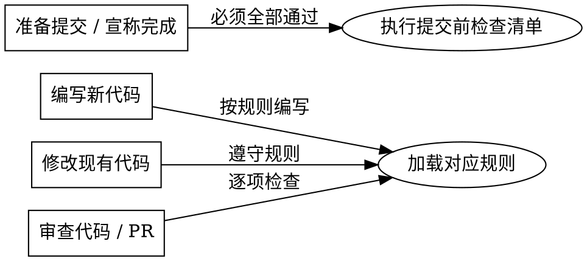

# 前端编码规范

## 概述

通用前端编码规范与代码质量检查流程。自动识别 TS/JS 环境，按需加载规则。项目特有规则定义在项目 `CLAUDE.md` 或 `code_standards.md` 中，优先级高于本 skill。

## 适用场景



**不适用**: 编码问题咨询、项目架构、环境搭建、DevOps 流程。

## 环境检测

应用规则前，先检测项目环境：

1. 检查项目根目录是否存在 `tsconfig.json`
2. 存在 → **TypeScript 项目**：加载 `references/typescript.md`，应用所有 `(ts)` 标签的规则
3. 不存在 → **JavaScript 项目**：跳过所有 `(ts)` 标签的规则

## 执行流程

1. **编写代码时**：加载 `references/coding.md`，按规则编写
2. **编写 TS 代码时**：额外加载 `references/typescript.md`
3. **优化代码时**：加载 `references/performance.md`
4. **审查代码时**：将规则作为检查清单逐项核对
5. **提交代码前**：必须执行下方「提交前检查清单」

## 提交前检查清单

### 自动化检查

```bash
# TypeScript 项目执行类型检查
npx vue-tsc --noEmit 2>&1 | grep "src/views/修改的模块/"
# 或: npx tsc --noEmit

# Lint 检查
pnpm lint
# 或: npm run lint
```

### 手动检查

- [ ] 无未使用的导入、变量、函数
- [ ] 无注释掉的代码块
- [ ] 无 `console.log` / `console.warn` 调试语句（带模块/作者标识前缀的豁免）
- [ ] 无空函数（除非有 `TODO` 说明原因）
- [ ] `references/coding.md` 中所有 `(all)` 标签规则均已满足
- [ ] 所有 `(ts)` 标签规则均已满足（仅 TypeScript 项目）

## 速查表

| 问题                | 修复方案                    |
| ------------------- | --------------------------- |
| 未使用的导入/变量   | 直接删除                    |
| 注释代码块          | 完全删除或恢复使用          |
| `console.log`       | 删除或使用项目日志工具（带标识前缀的豁免） |
| 空函数              | 实现功能或添加 `TODO:` 说明 |
| 跳转后缺少 `return` | 在导航调用后立即 `return`   |
| 数组方法无类型守卫  | 添加 `Array.isArray()` 检查 |

## 红灯警告

以下想法意味着你正在违反规范，应该立即纠正：

| 借口                              | 现实                                  |
| --------------------------------- | ------------------------------------- |
| "这个 `console.log` 只是临时调试" | 临时代码不应提交 — 使用项目日志工具或添加标识前缀 |
| "历史代码也用 `==`"               | 规范仅约束新增代码，历史代码保持不变  |
| "这个 `ref([])` 类型以后再加"     | 以后也不会加 — 立即补上泛型类型       |
| "这个组件太小不需要 scoped"       | 通用类名必须加 scoped，与组件大小无关 |
| "遵守规范太慢了"                  | 写完再排查问题花的时间更长            |
